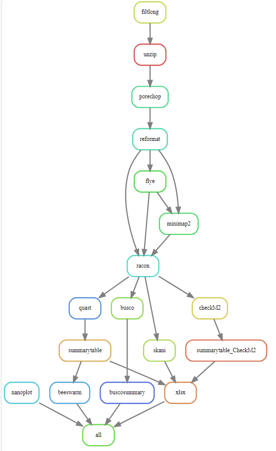

# Nanopore_only pipeline
Marie Hannaert\
ILVO

Nanopore pipeline is a pipeline to analyze long-reads from Nanopore.
This repository is a snakemake workflow that can be used to analyze long-read data specific for bacterial genomes. Everything needed can be found in this repository. I made this pipeline during my traineeship at ILVO-Plant. 

## Installing the Nanopore pipeline
Snakemake is a workflow management system that helps to create and execute data processing pipelines. It requires Python 3 and can be most easily installed via the bioconda package.

### Installing Mamba
The first step to installing Mamba is installing Miniforge:
#### Unix-like platforms (Mac OS & Linux)
````
$ curl -L -O "https://github.com/conda-forge/miniforge/releases/latest/download/Miniforge3-$(uname)-$(uname -m).sh"
$ bash Miniforge3-$(uname)-$(uname -m).sh
````
or 
````
$ wget "https://github.com/conda-forge/miniforge/releases/latest/download/Miniforge3-$(uname)-$(uname -m).sh"
$ bash Miniforge3-$(uname)-$(uname -m).sh
````
If this worked the installation of Mamba is done, if this didn't work you can check the documentation of Miniforge with the following link:
[MiniForge](https://github.com/conda-forge/miniforge#mambaforge)
### Installing Bioconda 
Then perform a one-time set up of Bioconda with the following commands. This will modify your ~/.condarc file:
````
$ mamba config --add channels defaults
$ mamba config --add channels bioconda
$ mamba config --add channels conda-forge
$ mamba config --set channel_priority strict
````
When you followed these steps Bioconda normally is installed, when it still doesn't work you can check the documentation with the following link: [Bioconda](https://bioconda.github.io/)
### Installing Snakemake 
Now creating the Snakemake enviroment, we will do this by creating a snakemake mamba enviroment:
````
$ mamba create -c conda-forge -c bioconda -n snakemake snakemake
````
If this was succesfull you can now use the following commands for activation and for help: 
````
$ mamba activate snakemake
$ snakemake --help
````
To check the documentation of Snakemake you can use the following link: [Snakemake](https://snakemake.readthedocs.io/en/stable/getting_started/installation.html)

### Downloading the Nanopore pipeline from Github
When you want to use the Nanopore pipeline, you can download the complete pipeline, including: scripts, conda enviroments, ... on your own local maching. Good practise is to make a directory **Snakemake/** where you can collect all of your pipelines. Downloading the Nanopore pipeline in your snakemake directory can be done by the following command: 
````
$ cd Snakemake/ 
$ git clone https://github.com/MarieHannaert/Long-read_Snakemake.git
````
### Making the database that is used for skANI
For using skANI you need to have a database, you can create one according to the following link: 
[Creating a database for skANI](https://github.com/bluenote-1577/skani/wiki/Tutorial:-setting-up-the-GTDB-genome-database-to-search-against)

When your database is installed you need to changed this path to the database in the Snakefile **Snakemake/Nanopore_only_Snakemake/Snakefile**, line 155. 


Now the snakemake enviroment is ready for use with the pipeline. 

## Executing the Nanopore pipeline 
Before you can execute this pipeline you need to perform a couple of preparing steps. 
### Preparing
In the **Long-read_Snakemake/** you need to make the following directories: **data/samples**
````
$ cd Long-read_Snakemake/
$ mkdir data/samples
````
In the samples directory you need to palce the samples that you want to analyse. They must look like the following two samples:
- sample1.fq.gz
- sample2.fq.gz

## Executing the Nanopore pipeline
Now everything is ready to run the pipeline. 
If you want to run the pipeline without any output, just checking it it works, you can use the following command in the **Long-read_Snakemake/**: 
````
$ snakemake -np
````
Now you will get an overview of all the steps in the pipeline. 

If you want to execute the pipeline and your samples are place in the **data/samples** directory, you can use the following command: 
````
$ snakemake -j 4
````
The -j option is needed when you work on a local server, this defines the number of treads that will be used to perform the pipeline, so you can chose the number yourself. 

### Pipeline content
The pipeline has eight big steps. Besides these steps there are some side steps to make summaries and visualisations. 
#### Nanoplot
Nanoplot is a tool special for long-reads. It will give an overview on the quality of the long-read data. After performing this tool you get a lot of different and viual outputs. 

Nanoplot documentation: [Nanoplot](https://github.com/wdecoster/NanoPlot)
#### Filtlong
Filtlong will filter long-reads based on the quality of these reads. It uses both read length (longer is better) and read identity (higher is better) when choosing which reads pass the filter.

Filtlong documentation: [Filtlong](https://github.com/rrwick/Filtlong)
#### Porechop ABI
Porechop ABI is a tool that process adapter sequences in ONT reads. Porechop original is a tool that will find and remove adapters from long-read data from nanopore sequencing. It will use the result from Filtlong as input. 

>The difference with the initial version of Porechop is that Porechop_ABI does not use any external knowledge or database for the adapters. Adapters are discovered directly from the reads using approximate k-mers counting and assembly. Then these sequences can be used for trimming, using all standard Porechop options.

Porechop ABI documentation: [PorechopABI](https://github.com/bonsai-team/Porechop_ABI)
#### Flye
Flye is a tool specific for single-molecule reads, like long-reads. It will polish reads. It uses the the output from Porechop ABI as input. 

Flye documentation: [Flye](https://github.com/fenderglass/Flye)
#### Racon 
>The goal of Racon is to generate genomic consensus which is of similar or better quality compared to the output generated by assembly methods which employ both error correction and consensus steps, while providing a speedup of several times compared to those methods.

Before Racon can be performed you need to perform [minimap2](https://github.com/lh3/minimap2) on the output of flye. Then the output of this minimap will be combined with the output of porechop ABI. 

Racon documentation: [RACON](https://github.com/isovic/racon)
#### skANI
skANI is a program for calculating average nucleotide identity (ANI) from DNA sequences (contigs/MAGs/genomes) for ANI > ~80%.
The output of skANI is a summary file: **skani_results_file.txt**, this info will be put in a xlsx file togheter with Quast summary file. 

SkANI documentation: [skANI](https://github.com/bluenote-1577/skani)
#### Quast
Quast is a Quality Assessment Tool for Genome Assemblies by CAB. The output will be a directory of each sample. From these directories we will make a summary file: **quast_summary_table.txt**. The information of this summary file will also be added to the XLSX file togheter with skANI summary file, the result can be found in the file **skANI_Quast_output.xlsx**. From the summary file of Quast we will also make some beeswarm visualisation vor the number of contigs and the N50. This can be found in the following file **beeswarm_vis_assemblies.png**. 

Quast documentation: [Quast](https://quast.sourceforge.net/)
#### Busco
Assessing Genome Assembly and Annotation Completeness.
Based on evolutionarily-informed expectations of gene content of near-universal single-copy orthologs, the BUSCO metric is complementary to technical metrics like N50.
The output of Busco is a directory for each sample. To make it more visible, there will be made a summary graph per fifteteen samples. 

Busco documentation: [Busco](https://busco.ezlab.org/)
## Finish
When your done executing the pipeline you will find the following structure in you **Long-read_Snakemake/**:
````
Snakemake/
├─ Nanopore_only_Snakemake/
|  ├─ .snakemake
│  ├─ data/
|  |  ├─sampels/
|  ├─ envs
|  ├─ scripts/
|  |  ├─beeswarm_vis_assemblies.R
|  |  ├─busco_summary.sh
|  |  ├─skani_quast_to_xlsx.py
|  ├─ Snakefile
│  ├─ results/
|  |  ├─01_nanoplot/
|  |  ├─02_filtlong/
|  |  ├─03_porechopABI/
|  |  ├─04_flye/
|  |  ├─05_racon/
|  |  ├─06_skani/
|  |  ├─07_quast/
|  |  ├─08_busco/
|  |  ├─assemblies/
|  |  ├─busco_summary/
│  ├─ README
│  ├─ logs
````
## Overview of Nanopore pipeline

